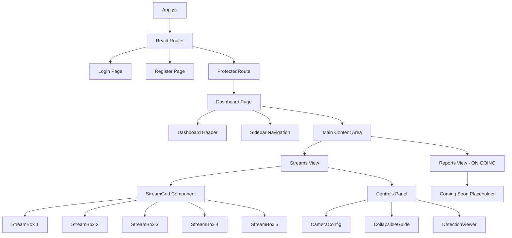
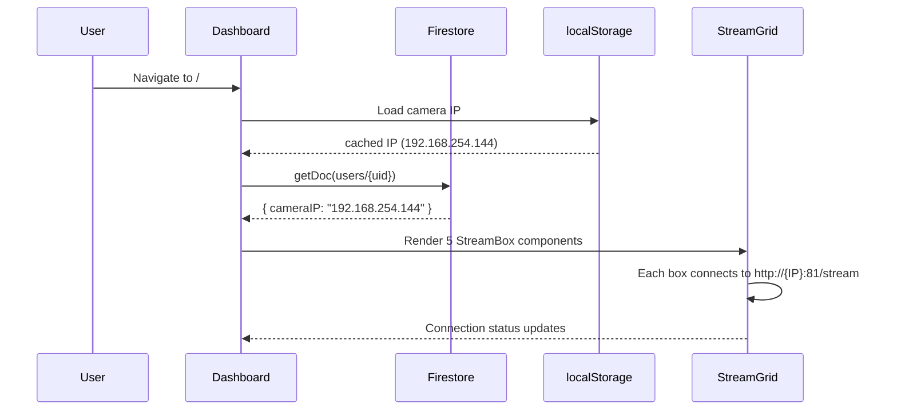
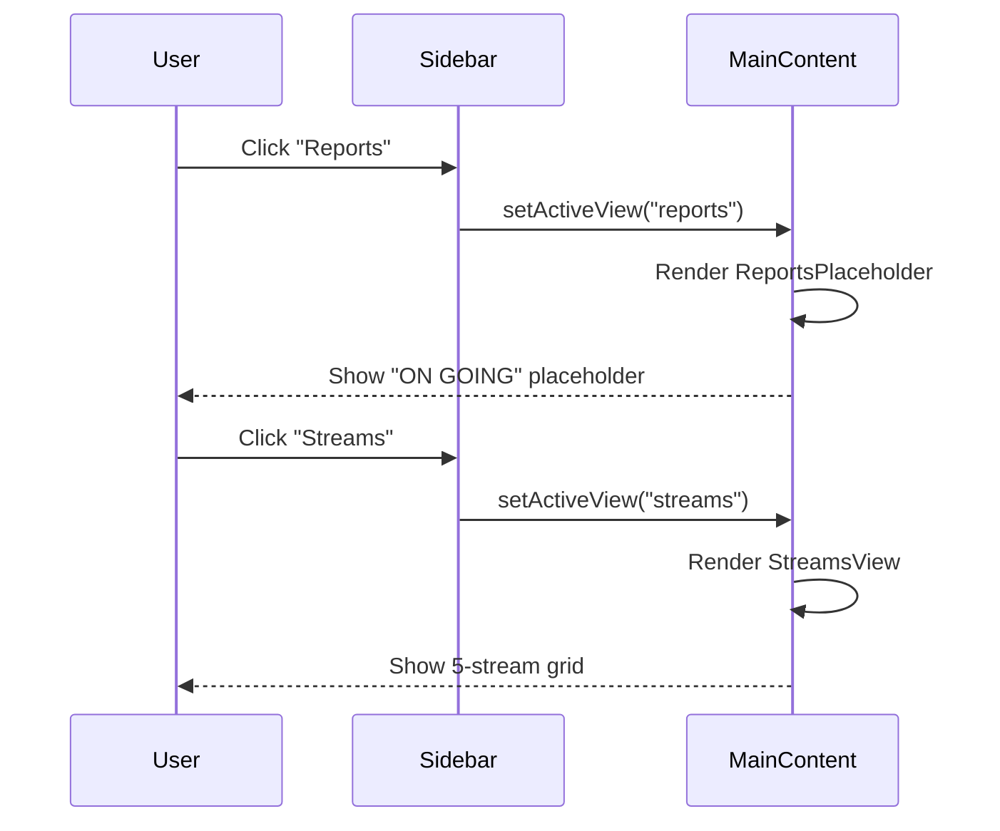
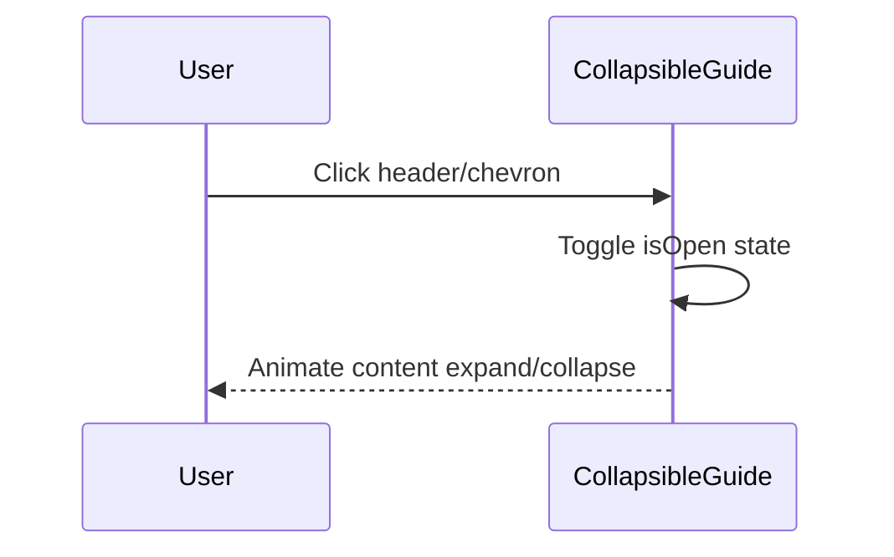

# Design Document: Dashboard Redesign

## Overview

The Hazora web dashboard is being redesigned to support multi-stream monitoring, improved UI organization, and future analytics capabilities. The current single-stream layout will be replaced with a 5-stream grid view, the Camera Setup Guide will become a collapsible section, a proper dashboard landing view will be introduced, and a placeholder Report/Analytics section will be added marked as "ON GOING."

The redesign preserves the existing dark theme (#0f1923 background, #1a2332 panels, #00d4aa teal accents) and maintains all current functionality (Firebase auth, Firestore IP persistence, AI detection) while expanding the layout to accommodate multiple camera feeds from the same IP (192.168.254.144).

## Architecture



## Sequence Diagrams

### Dashboard Load Flow



### Sidebar Navigation Flow



### Collapsible Guide Interaction



## Components and Interfaces

### Component 1: Dashboard (Redesigned Page)

**Purpose**: Main authenticated page that orchestrates the sidebar navigation, header, and content views.

**Interface**:
```jsx
// Props: none (uses AuthContext internally)
// State:
interface DashboardState {
  cameraIP: string;              // "192.168.254.144"
  connectionStatus: 'connected' | 'disconnected' | 'loading';
  isConnecting: boolean;
  ipLoading: boolean;
  activeView: 'streams' | 'reports';  // NEW: sidebar navigation
}
```

**Responsibilities**:
- Manage camera IP state and Firestore persistence
- Render sidebar navigation with view switching
- Render header with user info and connection status
- Delegate to StreamsView or ReportsView based on activeView

### Component 2: Sidebar

**Purpose**: Vertical navigation panel for switching between dashboard views.

**Interface**:
```jsx
interface SidebarProps {
  activeView: 'streams' | 'reports';
  onViewChange: (view: 'streams' | 'reports') => void;
}
```

**Responsibilities**:
- Display navigation items with icons
- Highlight active view
- Trigger view changes on click

### Component 3: StreamGrid

**Purpose**: Renders a responsive grid of 5 stream boxes, all connected to the same camera IP.

**Interface**:
```jsx
interface StreamGridProps {
  cameraIP: string;
  isConnecting: boolean;
  onStatusChange: (status: string) => void;
}
```

**Responsibilities**:
- Render 5 StreamBox components in a CSS grid layout
- Each StreamBox connects to the same IP (192.168.254.144)
- Handle responsive layout (3+2 on desktop, stacked on mobile)

### Component 4: StreamBox

**Purpose**: Individual stream viewer with its own label and connection state. Replaces the single StreamViewer for multi-view use.

**Interface**:
```jsx
interface StreamBoxProps {
  cameraIP: string;
  isConnecting: boolean;
  label: string;                 // "Stream 1", "Stream 2", etc.
  onStatusChange: (status: string) => void;
}
```

**Responsibilities**:
- Display live MJPEG stream from camera
- Show loading/placeholder states
- Display stream label overlay

### Component 5: CollapsibleGuide

**Purpose**: Wraps the Camera Setup Guide in a collapsible/dropdown container.

**Interface**:
```jsx
interface CollapsibleGuideProps {
  title: string;                 // "Camera Setup Guide"
  defaultOpen?: boolean;         // false by default
  children: React.ReactNode;     // The guide content (ol list)
}
```

**Responsibilities**:
- Toggle visibility of children on header click
- Animate expand/collapse with CSS transitions
- Show chevron indicator for open/closed state
- Persist collapsed state (starts collapsed by default)

### Component 6: ReportsPlaceholder

**Purpose**: Placeholder view for the Report/Analytics section, marked as "ON GOING."

**Interface**:
```jsx
// Props: none
```

**Responsibilities**:
- Display "Report & Analytics" heading
- Show "ON GOING" badge/status indicator
- Display placeholder content (chart icons, coming soon message)
- Maintain visual consistency with dashboard theme

## Data Models

### Navigation State

```jsx
const VIEWS = {
  STREAMS: 'streams',
  REPORTS: 'reports',
};

// Sidebar navigation items
const NAV_ITEMS = [
  { id: 'streams', label: 'Live Streams', icon: 'camera' },
  { id: 'reports', label: 'Reports', icon: 'chart', badge: 'ON GOING' },
];
```

### Stream Configuration

```jsx
// Each of the 5 stream boxes uses the same config
const STREAM_COUNT = 5;
const DEFAULT_CAMERA_IP = '192.168.254.144';

interface StreamConfig {
  id: number;                    // 1-5
  label: string;                 // "Stream 1" through "Stream 5"
  cameraIP: string;              // Same IP for all boxes
  streamPort: number;            // 81 (MJPEG stream port)
}
```

**Validation Rules**:
- cameraIP must pass IPv4 validation (existing validateIPv4 function)
- streamPort defaults to 81
- STREAM_COUNT is fixed at 5

## Algorithmic Pseudocode

### Dashboard View Switching Algorithm

```jsx
function Dashboard() {
  const [activeView, setActiveView] = useState('streams');
  
  // PRECONDITION: user is authenticated (ProtectedRoute ensures this)
  // POSTCONDITION: renders correct view based on activeView state
  // INVARIANT: activeView is always one of VIEWS values
  
  function handleViewChange(view) {
    // PRECONDITION: view ∈ {'streams', 'reports'}
    // POSTCONDITION: activeView === view, UI re-renders with new view
    if (Object.values(VIEWS).includes(view)) {
      setActiveView(view);
    }
  }

  return (
    <div className="dashboard">
      <Header />
      <div className="dashboard-body">
        <Sidebar activeView={activeView} onViewChange={handleViewChange} />
        <main className="dashboard-content">
          {activeView === 'streams' && <StreamsView />}
          {activeView === 'reports' && <ReportsPlaceholder />}
        </main>
      </div>
    </div>
  );
}
```

### Stream Grid Rendering Algorithm

```jsx
function StreamGrid({ cameraIP, isConnecting, onStatusChange }) {
  // PRECONDITION: cameraIP is valid IPv4 or empty string
  // POSTCONDITION: renders exactly STREAM_COUNT StreamBox components
  // INVARIANT: all boxes share the same cameraIP
  
  const streams = Array.from({ length: STREAM_COUNT }, (_, i) => ({
    id: i + 1,
    label: `Stream ${i + 1}`,
  }));

  return (
    <div className="stream-grid">
      {streams.map(stream => (
        <StreamBox
          key={stream.id}
          cameraIP={cameraIP}
          isConnecting={isConnecting}
          label={stream.label}
          onStatusChange={onStatusChange}
        />
      ))}
    </div>
  );
}
```

### Collapsible Toggle Algorithm

```jsx
function CollapsibleGuide({ title, defaultOpen = false, children }) {
  const [isOpen, setIsOpen] = useState(defaultOpen);
  const contentRef = useRef(null);

  // PRECONDITION: title is non-empty string
  // POSTCONDITION: content visibility matches isOpen state
  // INVARIANT: isOpen is boolean, content height transitions smoothly
  
  function toggle() {
    // POSTCONDITION: isOpen = !isOpen (previous value)
    setIsOpen(prev => !prev);
  }

  return (
    <div className="collapsible-guide">
      <button
        className="collapsible-header"
        onClick={toggle}
        aria-expanded={isOpen}
        aria-controls="guide-content"
      >
        <h3>{title}</h3>
        <span className={`chevron ${isOpen ? 'open' : ''}`}>▶</span>
      </button>
      <div
        id="guide-content"
        ref={contentRef}
        className={`collapsible-content ${isOpen ? 'expanded' : 'collapsed'}`}
        role="region"
        aria-labelledby="guide-title"
      >
        {children}
      </div>
    </div>
  );
}
```

## Key Functions with Formal Specifications

### Function 1: handleViewChange(view)

```jsx
function handleViewChange(view: 'streams' | 'reports'): void
```

**Preconditions:**
- `view` is one of the defined VIEWS values
- Dashboard component is mounted and authenticated

**Postconditions:**
- `activeView` state equals `view`
- Correct content component renders in main area
- Sidebar highlights the selected item

**Loop Invariants:** N/A

### Function 2: StreamGrid render

```jsx
function StreamGrid({ cameraIP, isConnecting, onStatusChange }): JSX.Element
```

**Preconditions:**
- `cameraIP` is either empty string or valid IPv4 address
- `onStatusChange` is a callable function

**Postconditions:**
- Exactly 5 StreamBox components are rendered
- Each StreamBox receives the same `cameraIP`
- Grid layout is responsive (3+2 on desktop, 1 column on mobile)

**Loop Invariants:**
- For each iteration i (0 to 4): stream.id === i + 1 and stream.label === `Stream ${i+1}`

### Function 3: CollapsibleGuide toggle

```jsx
function toggle(): void
```

**Preconditions:**
- Component is mounted
- `isOpen` state is a boolean value

**Postconditions:**
- `isOpen` state is negated from previous value
- CSS transition animates content height
- `aria-expanded` attribute reflects new state

**Loop Invariants:** N/A

## Example Usage

```jsx
// Dashboard.jsx - Redesigned structure
import Sidebar from '../components/Sidebar';
import StreamGrid from '../components/StreamGrid';
import CollapsibleGuide from '../components/CollapsibleGuide';
import ReportsPlaceholder from '../components/ReportsPlaceholder';

function Dashboard() {
  const [activeView, setActiveView] = useState('streams');
  const [cameraIP, setCameraIP] = useState('');
  // ... existing state ...

  return (
    <div className="dashboard">
      <header className="dashboard-header">
        <div className="header-left">
          <h1>HAZORA</h1>
          <ConnectionIndicator status={connectionStatus} />
        </div>
        <div className="header-right">
          <span className="user-email">{user.email}</span>
          <button className="logout-btn" onClick={handleLogout}>Logout</button>
        </div>
      </header>

      <div className="dashboard-body">
        <Sidebar activeView={activeView} onViewChange={setActiveView} />

        <main className="dashboard-content">
          {activeView === 'streams' && (
            <div className="streams-view">
              <StreamGrid
                cameraIP={cameraIP}
                isConnecting={isConnecting}
                onStatusChange={handleStatusChange}
              />
              <aside className="controls-panel">
                <CameraConfig cameraIP={cameraIP} onConnect={handleConnect} disabled={ipLoading} />
                <CollapsibleGuide title="Camera Setup Guide" defaultOpen={false}>
                  <ol>
                    <li>Power on the ESP32-CAM</li>
                    <li>Connect to Wi-Fi: <strong>HAZORA_CAM_SETUP</strong></li>
                    <li>Enter your Wi-Fi credentials on the setup page</li>
                    <li>Find the camera IP in Serial Monitor</li>
                    <li>Enter that IP above and click Connect</li>
                  </ol>
                </CollapsibleGuide>
                <DetectionViewer cameraIP={cameraIP} isConnected={connectionStatus === 'connected'} />
              </aside>
            </div>
          )}

          {activeView === 'reports' && <ReportsPlaceholder />}
        </main>
      </div>
    </div>
  );
}
```

```jsx
// ReportsPlaceholder.jsx
function ReportsPlaceholder() {
  return (
    <div className="reports-placeholder">
      <div className="reports-header">
        <h2>Report & Analytics</h2>
        <span className="badge ongoing">ON GOING</span>
      </div>
      <div className="reports-content">
        <div className="placeholder-icon">📊</div>
        <p>Analytics and reporting features are currently under development.</p>
        <p className="subtitle">Detection logs, activity charts, and export capabilities coming soon.</p>
      </div>
    </div>
  );
}
```

## Correctness Properties

*A property is a characteristic or behavior that should hold true across all valid executions of a system—essentially, a formal statement about what the system should do. Properties serve as the bridge between human-readable specifications and machine-verifiable correctness guarantees.*

### Property 1: Exclusive View Rendering

*For any* ActiveView state in {streams, reports}, the Dashboard SHALL render exactly one content view component. No two views are rendered simultaneously, and switching views always results in exactly one visible content area.

**Validates: Requirements 3.1, 3.2, 3.3**

### Property 2: Uniform Camera IP

*For any* valid CameraIP value, all 5 StreamBox components in the StreamGrid SHALL receive the same CameraIP prop. When the CameraIP changes, all boxes update to the new value simultaneously.

**Validates: Requirements 1.3, 1.4**

### Property 3: Fixed Stream Count and Deterministic Labels

*For any* rendering of the StreamGrid component, exactly 5 StreamBox components SHALL be rendered, and each StreamBox SHALL have a label matching the pattern "Stream {id}" where id is its sequential position (1 through 5).

**Validates: Requirements 1.1, 1.5**

### Property 4: Toggle Inversion with Accessibility State Consistency

*For any* CollapsibleGuide in state isOpen, clicking the header SHALL result in isOpen being negated. Additionally, the aria-expanded attribute SHALL always equal the current isOpen state, and the chevron indicator SHALL reflect the current state.

**Validates: Requirements 4.1, 4.3, 4.4, 4.6**

### Property 5: Invalid View Fallback

*For any* string value that is not "streams" or "reports", the Dashboard SHALL default the ActiveView to "streams", ensuring the navigation state is always valid.

**Validates: Requirements 2.5**

### Property 6: IPv4 Validation

*For any* string input to the CameraIP field, the Dashboard SHALL correctly classify it as a valid or invalid IPv4 address before initiating a connection. Only strings matching the IPv4 format (four octets 0-255 separated by dots) SHALL be accepted.

**Validates: Requirements 6.5**

### Property 7: Camera IP Persistence Round-Trip

*For any* valid CameraIP that a user connects with, persisting it and then loading it back SHALL produce the same CameraIP value (localStorage write then read returns the original IP).

**Validates: Requirements 6.3**

### Property 8: Sidebar Active Highlight Consistency

*For any* ActiveView state, the Sidebar SHALL visually highlight exactly the navigation item corresponding to that view. The highlighted item always matches the current ActiveView.

**Validates: Requirements 2.2, 2.3**

## Error Handling

### Error Scenario 1: Stream Connection Failure

**Condition**: Camera at IP is unreachable or stream endpoint returns error
**Response**: Individual StreamBox shows placeholder with "Connection failed" message
**Recovery**: User can re-enter IP and click Connect; all 5 boxes retry simultaneously

### Error Scenario 2: Invalid View State

**Condition**: activeView somehow set to invalid value
**Response**: Default to 'streams' view (fallback rendering)
**Recovery**: Sidebar click resets to valid state

### Error Scenario 3: Firestore Timeout on IP Load

**Condition**: Firestore takes >5s to respond (existing behavior)
**Response**: Falls back to localStorage cached IP, logs warning
**Recovery**: Automatic — uses cached value, Firestore save retried on next connect

## Testing Strategy

### Unit Testing Approach

- Test `CollapsibleGuide` toggle behavior (open/close state changes)
- Test `Sidebar` active item highlighting and click handlers
- Test `StreamGrid` renders exactly 5 StreamBox components
- Test `ReportsPlaceholder` renders "ON GOING" badge
- Test view switching logic in Dashboard

### Property-Based Testing Approach

**Property Test Library**: fast-check (compatible with Vite/React ecosystem)

- Property: For any sequence of view switches, only one view is active at a time
- Property: StreamGrid always renders exactly STREAM_COUNT boxes regardless of IP value
- Property: CollapsibleGuide toggle is its own inverse (toggle twice = original state)

### Integration Testing Approach

- Test full navigation flow: sidebar click → view renders → content visible
- Test camera IP propagation: enter IP → all 5 stream boxes receive it
- Test collapsible persistence: collapse guide → switch views → return → still collapsed

## Performance Considerations

- **5 simultaneous MJPEG streams**: Each StreamBox opens a separate HTTP connection to port 81. The ESP32-CAM may have connection limits — consider staggering connections or using a single stream with canvas duplication if bandwidth is an issue.
- **CSS Grid layout**: Use CSS Grid for the 5-box layout to avoid JavaScript-based layout calculations.
- **Lazy rendering**: Only render StreamBox img elements when `isConnecting` is true to avoid unnecessary network requests.
- **Collapsible animation**: Use `max-height` CSS transition rather than JavaScript animation for smooth 60fps collapse/expand.

## Security Considerations

- Camera IP is stored in Firestore per-user (existing pattern) — no cross-user access
- Stream connections are HTTP (not HTTPS) to local network camera — acceptable for LAN-only ESP32-CAM
- No new authentication surfaces introduced; existing Firebase auth + ProtectedRoute pattern maintained

## Dependencies

- **Existing**: React 19, React Router 7, Firebase 12, TensorFlow.js, Vite 8
- **No new dependencies required** — all new components use standard React patterns and CSS
- Collapsible animation uses CSS transitions (no animation library needed)
- Grid layout uses CSS Grid (native browser support)
