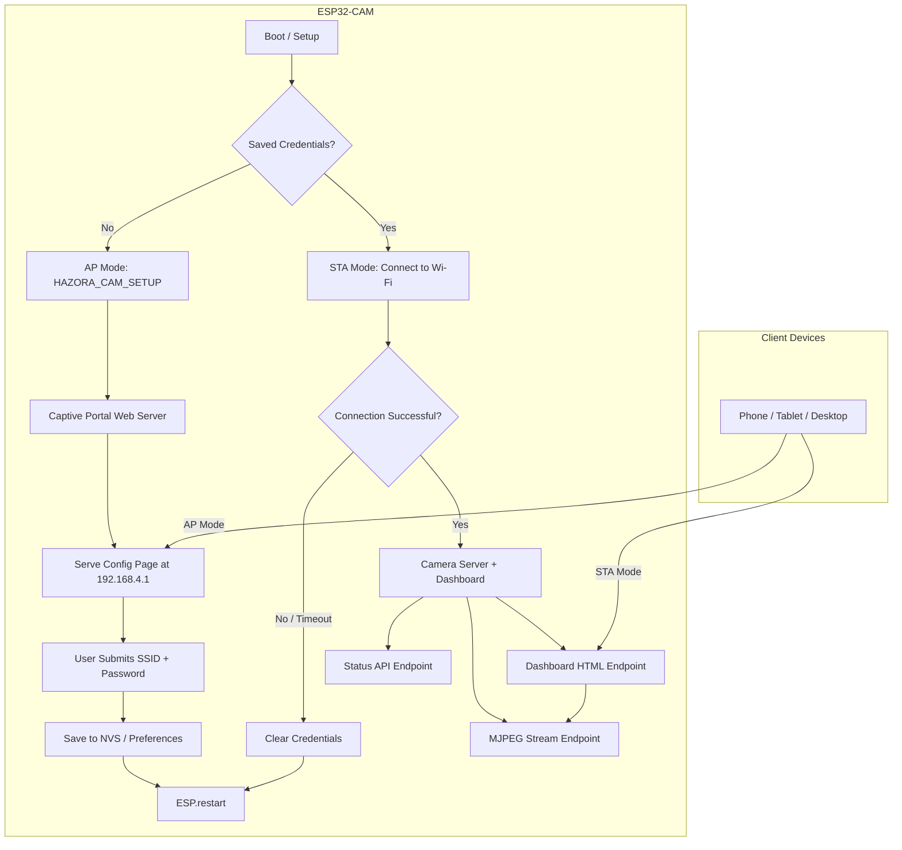
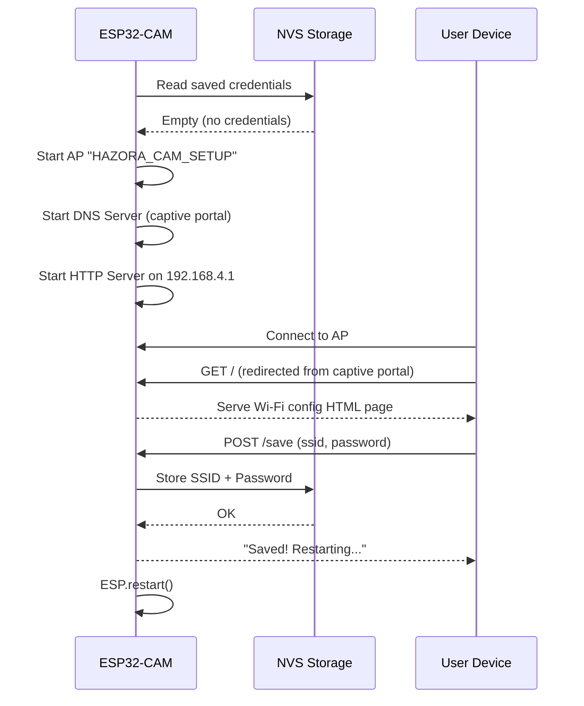
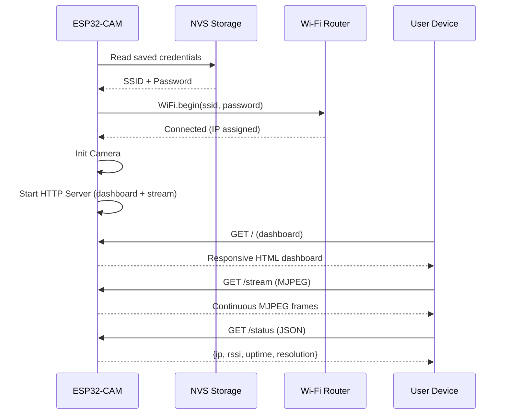
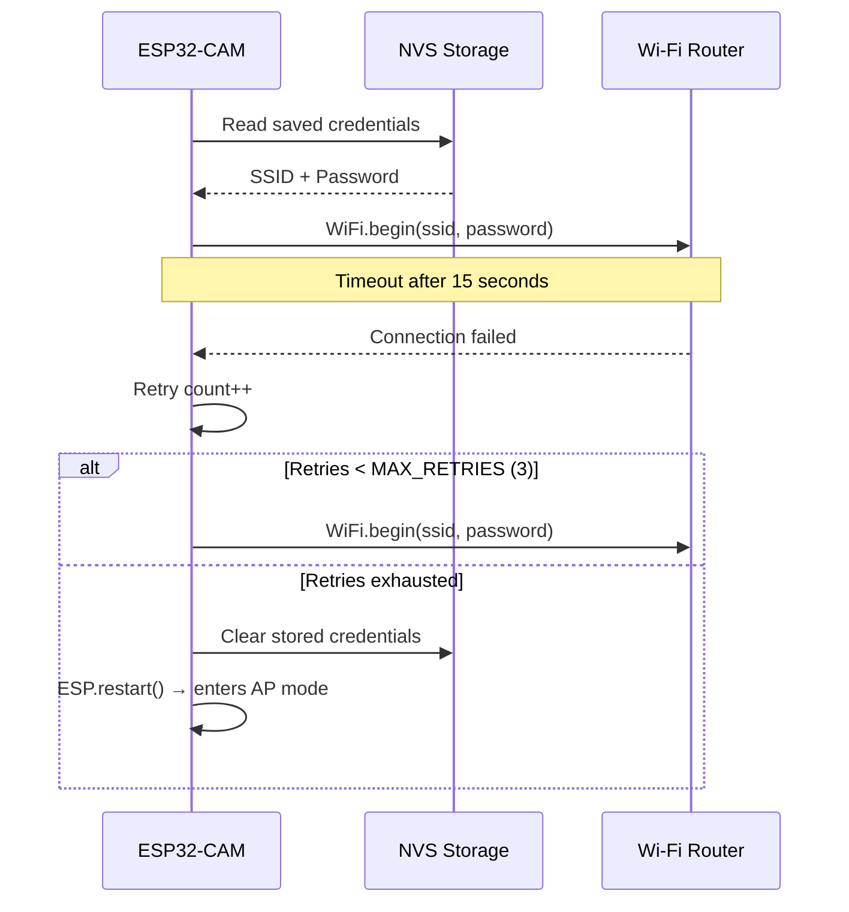

# Design Document: ESP32-CAM Wi-Fi Provisioning Portal & Responsive Dashboard

## Overview

This feature is part of the **HAZORA** (Hazard Detection System) capstone project for ArchEn Inc. construction site safety monitoring. It replaces the hardcoded Wi-Fi credentials in the ESP32-CAM firmware with a captive portal-based provisioning system and adds a responsive web dashboard for camera stream monitoring.

When no Wi-Fi credentials are stored, the ESP32-CAM creates a temporary access point ("HAZORA_CAM_SETUP") serving a configuration page. Once credentials are saved, the device connects to the target network and serves a responsive monitoring dashboard accessible from any device on the same network. This allows field engineers to easily deploy ESP32-CAM units on construction sites without reflashing firmware for each Wi-Fi network.

The system has two distinct runtime modes: **Provisioning Mode** (AP with captive portal for initial setup) and **Monitoring Mode** (STA connected to site Wi-Fi, serving camera stream via responsive dashboard). Credentials persist in ESP32 non-volatile storage (Preferences) across reboots. The camera stream from this module will later integrate with the Teachable Machine AI detection pipeline for hard hat and hazard monitoring.

## Architecture



## Sequence Diagrams

### Provisioning Flow



### Monitoring Flow



### Connection Failure Recovery



## Components and Interfaces

### Component 1: Credential Manager

**Purpose**: Handles persistent storage and retrieval of Wi-Fi credentials using ESP32 Preferences (NVS).

```cpp
class CredentialManager {
public:
    void begin();
    bool hasCredentials();
    String getSSID();
    String getPassword();
    void saveCredentials(const String& ssid, const String& password);
    void clearCredentials();
};
```

**Responsibilities**:
- Read/write Wi-Fi credentials to non-volatile storage
- Validate credential format before saving (non-empty SSID, password length)
- Provide clear interface for credential lifecycle

### Component 2: Provisioning Portal

**Purpose**: Manages AP mode, DNS captive portal, and the configuration web page.

```cpp
class ProvisioningPortal {
public:
    void start(const char* apName);
    void stop();
    void handleClient();  // called in loop
    bool isCredentialSubmitted();
    String getSubmittedSSID();
    String getSubmittedPassword();

private:
    void handleRoot();        // GET /
    void handleSave();        // POST /save
    void handleNotFound();    // Captive portal redirect
    String buildConfigPage();
};
```

**Responsibilities**:
- Create and manage the "HAZORA_CAM_SETUP" access point
- Run DNS server to redirect all requests to 192.168.4.1 (captive portal)
- Serve the Wi-Fi configuration HTML page
- Parse and validate submitted credentials
- Signal when new credentials are available

### Component 3: Camera Stream Server

**Purpose**: Handles camera initialization and MJPEG streaming over HTTP.

```cpp
class CameraStreamServer {
public:
    bool initCamera();
    void startServer();
    void handleStream();    // GET /stream - MJPEG
    void handleCapture();   // GET /capture - single JPEG frame
    void handleStatus();    // GET /status - JSON status

private:
    camera_config_t getCameraConfig();
};
```

**Responsibilities**:
- Initialize ESP32-CAM hardware with AI-Thinker pin configuration
- Serve MJPEG stream for real-time monitoring
- Provide single-frame capture endpoint
- Report device status (IP, RSSI, uptime, resolution)

### Component 4: Dashboard Server

**Purpose**: Serves the responsive web dashboard HTML/CSS/JS to client browsers.

```cpp
class DashboardServer {
public:
    void startServer(uint16_t port = 80);
    void handleDashboard();   // GET / - main dashboard page
    void handleReset();       // POST /reset - clear credentials

private:
    String buildDashboardPage();
};
```

**Responsibilities**:
- Serve responsive HTML dashboard (embedded in firmware as PROGMEM)
- Provide reset endpoint to clear credentials and re-enter provisioning mode
- Adapt layout for phone, tablet, and desktop viewports

## Data Models

### Stored Credentials

```cpp
struct WiFiCredentials {
    char ssid[33];       // Max SSID length: 32 chars + null
    char password[65];   // Max WPA2 password: 64 chars + null
    bool valid;          // Flag indicating if credentials are stored
};
```

**Validation Rules**:
- SSID must be 1-32 characters, non-empty
- Password must be 8-64 characters (WPA2 minimum is 8)
- Both fields must not contain only whitespace

### Device Status

```cpp
struct DeviceStatus {
    char ip[16];           // Current IP address
    int rssi;              // Wi-Fi signal strength (dBm)
    unsigned long uptime;  // Milliseconds since boot
    char resolution[10];   // Current frame size (e.g., "QVGA")
    bool streaming;        // Whether stream is active
};
```

### HTTP Endpoints

| Endpoint | Method | Mode | Description |
|----------|--------|------|-------------|
| `/` | GET | AP | Wi-Fi configuration page |
| `/save` | POST | AP | Save credentials (form: ssid, password) |
| `/` | GET | STA | Responsive monitoring dashboard |
| `/stream` | GET | STA | MJPEG video stream |
| `/capture` | GET | STA | Single JPEG frame |
| `/status` | GET | STA | JSON device status |
| `/reset` | POST | STA | Clear credentials, restart |

## Algorithmic Pseudocode

### Main Setup Algorithm

```cpp
// ALGORITHM: ESP32-CAM Main Setup
// INPUT: None (reads from NVS on boot)
// OUTPUT: Device in either AP mode or STA mode serving content

void setup() {
    Serial.begin(115200);
    
    // Step 1: Initialize credential manager
    credentialManager.begin();
    
    // Step 2: Check for stored credentials
    if (!credentialManager.hasCredentials()) {
        // No credentials → Provisioning Mode
        enterProvisioningMode();
    } else {
        // Credentials exist → attempt connection
        bool connected = attemptWiFiConnection(
            credentialManager.getSSID(),
            credentialManager.getPassword()
        );
        
        if (connected) {
            enterMonitoringMode();
        } else {
            // Connection failed after retries → clear and reprovision
            credentialManager.clearCredentials();
            ESP.restart();
        }
    }
}
```

**Preconditions:**
- ESP32-CAM hardware is functional
- NVS partition is accessible

**Postconditions:**
- Device is either serving captive portal (AP mode) or camera dashboard (STA mode)
- LED indicates current mode (blinking = AP, solid = connected)

### Wi-Fi Connection Algorithm

```cpp
// ALGORITHM: Attempt Wi-Fi Connection with Retries
// INPUT: ssid (String), password (String)
// OUTPUT: bool (true if connected, false if all retries exhausted)

bool attemptWiFiConnection(const String& ssid, const String& password) {
    const int MAX_RETRIES = 3;
    const int TIMEOUT_MS = 15000;  // 15 seconds per attempt
    
    WiFi.mode(WIFI_STA);
    WiFi.setSleep(false);
    
    for (int attempt = 0; attempt < MAX_RETRIES; attempt++) {
        // LOOP INVARIANT: attempt < MAX_RETRIES, WiFi not yet connected
        
        Serial.printf("Connection attempt %d/%d\n", attempt + 1, MAX_RETRIES);
        WiFi.begin(ssid.c_str(), password.c_str());
        
        unsigned long startTime = millis();
        while (WiFi.status() != WL_CONNECTED) {
            if (millis() - startTime > TIMEOUT_MS) {
                WiFi.disconnect();
                break;  // Timeout this attempt
            }
            delay(500);
        }
        
        if (WiFi.status() == WL_CONNECTED) {
            Serial.printf("Connected! IP: %s\n", WiFi.localIP().toString().c_str());
            return true;
        }
    }
    
    return false;  // All retries exhausted
}
```

**Preconditions:**
- `ssid` is non-empty (1-32 chars)
- `password` is valid length (8-64 chars)
- Wi-Fi hardware is initialized

**Postconditions:**
- Returns `true`: WiFi.status() == WL_CONNECTED, IP assigned
- Returns `false`: WiFi disconnected, ready for mode change

**Loop Invariants:**
- `attempt` is in range [0, MAX_RETRIES)
- Each iteration either connects successfully or times out cleanly

### Credential Save Algorithm

```cpp
// ALGORITHM: Save and Validate Credentials
// INPUT: ssid (String from form), password (String from form)
// OUTPUT: bool (true if saved successfully)

bool saveCredentials(const String& ssid, const String& password) {
    // Validate inputs
    String trimmedSSID = ssid;
    trimmedSSID.trim();
    
    if (trimmedSSID.length() == 0 || trimmedSSID.length() > 32) {
        return false;  // Invalid SSID
    }
    
    if (password.length() < 8 || password.length() > 64) {
        return false;  // Invalid password length
    }
    
    // Store in NVS
    Preferences preferences;
    preferences.begin("wifi", false);  // read-write mode
    preferences.putString("ssid", trimmedSSID);
    preferences.putString("password", password);
    preferences.putBool("valid", true);
    preferences.end();
    
    return true;
}
```

**Preconditions:**
- Preferences namespace "wifi" is accessible
- Input strings are non-null

**Postconditions:**
- If returns `true`: credentials are persisted in NVS, survive reboot
- If returns `false`: NVS is unchanged, no partial writes

## Key Functions with Formal Specifications

### Function: initCamera()

```cpp
bool initCamera();
```

**Preconditions:**
- GPIO pins match AI-Thinker ESP32-CAM board layout
- PSRAM is available (for VGA resolution)
- Camera module is physically connected

**Postconditions:**
- Returns `true`: camera is initialized, `esp_camera_sensor_get()` returns valid sensor
- Returns `false`: camera hardware error, serial error message printed
- Frame size set to QVGA (320x240) for streaming performance

### Function: buildConfigPage()

```cpp
String buildConfigPage();
```

**Preconditions:**
- Called only in AP/provisioning mode
- Sufficient heap memory for HTML string construction

**Postconditions:**
- Returns valid HTML5 string with responsive form
- Form contains SSID input (text), password input (password), submit button
- Form action is POST to `/save`
- Page is mobile-friendly (viewport meta tag, responsive CSS)

### Function: buildDashboardPage()

```cpp
String buildDashboardPage();
```

**Preconditions:**
- Called only in STA/monitoring mode
- Device has valid IP address assigned

**Postconditions:**
- Returns valid HTML5 string with responsive dashboard
- Dashboard includes: MJPEG stream viewer, connection status, device info
- Layout adapts to phone (<768px), tablet (768-1024px), desktop (>1024px)
- Stream source points to `/stream` endpoint on same host

### Function: handleStream()

```cpp
void handleStream();
```

**Preconditions:**
- Camera is initialized successfully
- HTTP client is connected and requesting MJPEG
- Content-Type set to `multipart/x-mixed-replace`

**Postconditions:**
- Continuously sends JPEG frames with multipart boundaries
- Each frame is a complete JPEG image
- Stream terminates cleanly when client disconnects
- Frame buffer is returned to camera driver after each frame

## Example Usage

```cpp
#include <Arduino.h>
#include <WiFi.h>
#include <WebServer.h>
#include <Preferences.h>
#include <DNSServer.h>
#include "esp_camera.h"

// Global instances
CredentialManager credentialManager;
WebServer server(80);
DNSServer dnsServer;

void setup() {
    Serial.begin(115200);
    credentialManager.begin();

    if (!credentialManager.hasCredentials()) {
        // === PROVISIONING MODE ===
        WiFi.mode(WIFI_AP);
        WiFi.softAP("HAZORA_CAM_SETUP");
        
        // Captive portal DNS
        dnsServer.start(53, "*", WiFi.softAPIP());
        
        // Config page routes
        server.on("/", HTTP_GET, handleConfigPage);
        server.on("/save", HTTP_POST, handleSaveCredentials);
        server.onNotFound(handleCaptiveRedirect);
        server.begin();
        
        Serial.println("AP Mode: Connect to HAZORA_CAM_SETUP");
        Serial.println("Open http://192.168.4.1");
    } else {
        // === MONITORING MODE ===
        bool connected = attemptWiFiConnection(
            credentialManager.getSSID(),
            credentialManager.getPassword()
        );
        
        if (!connected) {
            credentialManager.clearCredentials();
            ESP.restart();
        }
        
        // Init camera
        if (!initCamera()) {
            Serial.println("Camera init failed!");
            return;
        }
        
        // Dashboard + stream routes
        server.on("/", HTTP_GET, handleDashboard);
        server.on("/stream", HTTP_GET, handleStream);
        server.on("/capture", HTTP_GET, handleCapture);
        server.on("/status", HTTP_GET, handleStatus);
        server.on("/reset", HTTP_POST, handleReset);
        server.begin();
        
        Serial.printf("Dashboard: http://%s\n", WiFi.localIP().toString().c_str());
    }
}

void loop() {
    dnsServer.processNextRequest();  // Only active in AP mode
    server.handleClient();
}
```

## Correctness Properties

1. **Credential Persistence**: ∀ credentials saved via `/save`, after `ESP.restart()`, `credentialManager.hasCredentials()` returns `true` and stored values match submitted values.

2. **Mode Exclusivity**: The device is in exactly one mode at any time: either AP (provisioning) or STA (monitoring). Never both simultaneously.

3. **Captive Portal Redirect**: ∀ HTTP requests to any domain while in AP mode, the response redirects to `192.168.4.1` (the config page).

4. **Connection Timeout Guarantee**: `attemptWiFiConnection()` terminates within `MAX_RETRIES × TIMEOUT_MS` milliseconds (worst case: 45 seconds).

5. **Credential Validation**: No credentials with empty SSID or password shorter than 8 characters are ever persisted to NVS.

6. **Stream Frame Integrity**: Each MJPEG frame sent to clients is a complete, valid JPEG image (frame buffer fully transmitted before boundary marker).

7. **Recovery from Bad Credentials**: If stored credentials fail to connect after `MAX_RETRIES` attempts, credentials are cleared and device re-enters provisioning mode on next boot.

8. **Dashboard Responsiveness**: The dashboard HTML renders correctly on viewports from 320px (phone) to 1920px+ (desktop) without horizontal scrolling.

## Error Handling

### Error Scenario 1: Camera Initialization Failure

**Condition**: `esp_camera_init()` returns error code (hardware fault, wrong pin config)
**Response**: Log error to Serial, do not start stream server, serve dashboard with error message
**Recovery**: User must power-cycle the device; no automatic recovery for hardware faults

### Error Scenario 2: Wi-Fi Connection Timeout

**Condition**: Cannot connect to saved SSID within 15 seconds per attempt, 3 attempts total
**Response**: Clear stored credentials from NVS
**Recovery**: Device restarts and enters AP provisioning mode automatically

### Error Scenario 3: NVS Storage Full/Corrupt

**Condition**: `Preferences.putString()` fails or NVS partition is corrupt
**Response**: Log error, remain in current mode (AP if provisioning, attempt restart if monitoring)
**Recovery**: User can erase flash via Arduino IDE to reset NVS partition

### Error Scenario 4: Client Disconnects During Stream

**Condition**: TCP connection drops while sending MJPEG frames
**Response**: Detect send failure, release frame buffer, close connection cleanly
**Recovery**: Automatic — next client connection starts fresh stream

### Error Scenario 5: Invalid Form Submission

**Condition**: User submits empty SSID or password < 8 characters
**Response**: Return error message on config page, do not save, do not restart
**Recovery**: User corrects input and resubmits

## Testing Strategy

### Unit Testing Approach

- Test `CredentialManager` save/load/clear cycle using mock NVS
- Test credential validation logic (boundary cases: 0, 1, 32, 33 char SSID; 7, 8, 64, 65 char password)
- Test HTML generation functions produce valid HTML with correct form structure
- Test status JSON endpoint returns valid JSON with expected fields

### Property-Based Testing Approach

**Property Test Library**: Custom assertions (ESP32 environment limits PBT library usage)

- **Roundtrip Property**: For any valid (ssid, password) pair, saving then loading returns identical values
- **Validation Boundary Property**: All SSIDs of length 1-32 and passwords of length 8-64 pass validation; all others fail
- **Idempotent Clear**: Calling `clearCredentials()` multiple times has same effect as calling once

### Integration Testing Approach

- Flash firmware to ESP32-CAM, verify AP mode activates on first boot
- Connect to AP, submit credentials via browser, verify restart and STA connection
- Verify MJPEG stream loads in Chrome, Firefox, Safari on phone and desktop
- Test credential reset via `/reset` endpoint returns device to AP mode
- Test with incorrect credentials to verify retry-and-clear behavior

## Performance Considerations

- **MJPEG Frame Rate**: Target 10-15 FPS at QVGA (320x240) resolution to balance quality and ESP32 processing
- **Memory**: Dashboard HTML stored in PROGMEM (flash) to preserve heap for camera frame buffers
- **Single Client Stream**: ESP32-CAM has limited bandwidth; design for 1-2 concurrent stream viewers
- **Wi-Fi Sleep Disabled**: `WiFi.setSleep(false)` ensures consistent stream delivery at cost of ~20mA extra power
- **DNS Processing**: Captive portal DNS only active in AP mode; zero overhead in monitoring mode

## Security Considerations

- **Credential Storage**: Stored in ESP32 NVS (encrypted flash partition on supported boards). Not encrypted at application level — acceptable for home/capstone use.
- **Open AP**: Provisioning AP has no password (intentional for easy setup). Mitigated by: AP only active when no credentials stored, short-lived setup window.
- **No HTTPS**: ESP32-CAM lacks resources for TLS. Dashboard served over HTTP. Acceptable for local network use.
- **Reset Protection**: `/reset` endpoint should require confirmation to prevent accidental credential wipe. Consider adding a physical reset button (GPIO) as alternative.
- **Input Sanitization**: All form inputs HTML-escaped before display; SSID/password validated for length before storage.

## Dependencies

| Dependency | Purpose | Source |
|------------|---------|--------|
| `WiFi.h` | Wi-Fi STA/AP management | ESP32 Arduino Core |
| `WebServer.h` | HTTP server for config + dashboard | ESP32 Arduino Core |
| `Preferences.h` | NVS credential storage | ESP32 Arduino Core |
| `DNSServer.h` | Captive portal DNS redirect | ESP32 Arduino Core |
| `esp_camera.h` | Camera hardware interface | ESP32 Arduino Core |
| Arduino Framework | Core runtime | PlatformIO / Arduino IDE |
