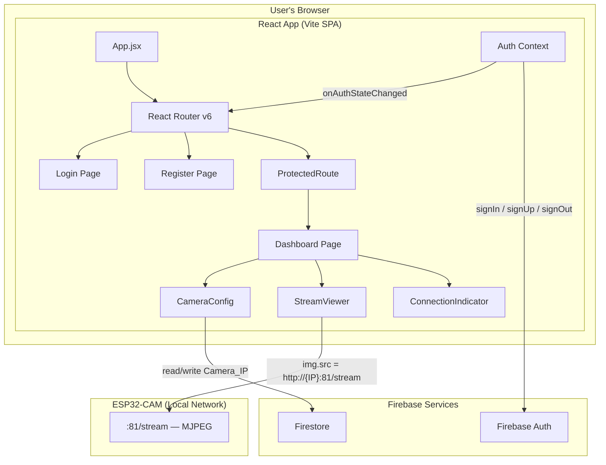
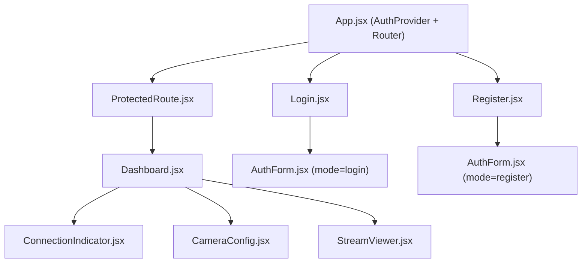
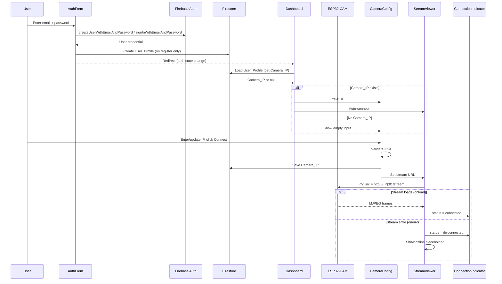
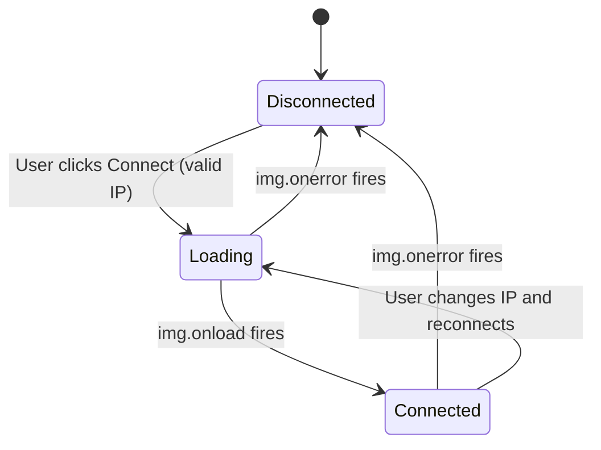

# Design Document: HAZORA Web Dashboard (Phase 1)

## Overview

The HAZORA Web Dashboard Phase 1 delivers a React single-page application for monitoring the ESP32-CAM Hazard Detection System on ArchEn Inc. construction sites. Phase 1 covers user authentication (Firebase Auth), camera IP configuration (Firestore persistence), live MJPEG stream viewing, connection status indication, and responsive layout.

The application is built with React 18+ and Vite, using Firebase for authentication and data persistence. It connects to the ESP32-CAM over the local network using the device's IP address stored per-user in Firestore.

**Key architectural decisions:**

| Decision | Rationale |
|----------|-----------|
| React 18 + Vite | Fast HMR, modern tooling, component-based architecture |
| Firebase Auth (email/password) | Zero backend — auth handled entirely client-side via Firebase SDK |
| Firestore for Camera_IP | Per-user persistence enables cross-device access |
| React Router v6 | Declarative routing with built-in outlet/layout patterns |
| CSS Modules (or plain CSS) | Scoped styles without additional dependencies |
| MJPEG via `` tag | Browser natively renders multipart JPEG streams — no video decoder needed |
| Environment variables for Firebase config | Keeps secrets out of source control via `.env` file |

**ESP32-CAM endpoints (already operational):**

| Endpoint | Port | Method | Purpose |
|----------|------|--------|---------|
| `/stream` | 81 | GET | MJPEG live video stream |
| `/capture` | 80 | GET | Single JPEG frame capture |
| `/status` | 80 | GET | Device status JSON |
| `/reset` | 80 | POST | Wi-Fi credential reset |

Phase 1 uses only `/stream` (port 81) for the live feed. Other endpoints are reserved for later phases.

## Architecture

### High-Level Architecture



### Component Tree



### Data Flow



## Components and Interfaces

### File: `src/firebase.js`

**Purpose:** Initialize and export Firebase app, auth, and Firestore instances.

```javascript
// firebase.js
import { initializeApp } from 'firebase/app';
import { getAuth } from 'firebase/auth';
import { getFirestore } from 'firebase/firestore';

const firebaseConfig = {
  apiKey: import.meta.env.VITE_FIREBASE_API_KEY,
  authDomain: import.meta.env.VITE_FIREBASE_AUTH_DOMAIN,
  projectId: import.meta.env.VITE_FIREBASE_PROJECT_ID,
  storageBucket: import.meta.env.VITE_FIREBASE_STORAGE_BUCKET,
  messagingSenderId: import.meta.env.VITE_FIREBASE_MESSAGING_SENDER_ID,
  appId: import.meta.env.VITE_FIREBASE_APP_ID,
};

const app = initializeApp(firebaseConfig);
export const auth = getAuth(app);
export const db = getFirestore(app);
```

---

### File: `src/App.jsx`

**Purpose:** Root component. Provides auth context and sets up routing.

```jsx
// App.jsx
import { BrowserRouter, Routes, Route, Navigate } from 'react-router-dom';
import { AuthProvider } from './context/AuthContext';
import Login from './pages/Login';
import Register from './pages/Register';
import Dashboard from './pages/Dashboard';
import ProtectedRoute from './components/ProtectedRoute';

function App() {
  return (
    <AuthProvider>
      <BrowserRouter>
        <Routes>
          <Route path="/login" element={<Login />} />
          <Route path="/register" element={<Register />} />
          <Route path="/" element={<ProtectedRoute><Dashboard /></ProtectedRoute>} />
          <Route path="*" element={<Navigate to="/" replace />} />
        </Routes>
      </BrowserRouter>
    </AuthProvider>
  );
}
```

**Auth Context (`src/context/AuthContext.jsx`):**

```jsx
// Provides: { user, loading } via React Context
// Subscribes to onAuthStateChanged(auth, callback)
// While loading === true, renders a loading spinner (prevents flash of login page)
```

| Export | Type | Description |
|--------|------|-------------|
| `AuthProvider` | Component | Wraps app, subscribes to auth state |
| `useAuth()` | Hook | Returns `{ user, loading }` |

---

### Component: `AuthForm.jsx`

**Purpose:** Reusable form for both login and registration. Handles validation, Firebase calls, and error display.

| Prop | Type | Description |
|------|------|-------------|
| `mode` | `'login' \| 'register'` | Determines form title, button text, and Firebase method |
| `onSuccess` | `() => void` | Callback after successful auth (navigation) |

**Internal State:**

| State | Type | Default | Description |
|-------|------|---------|-------------|
| `email` | string | `''` | Email input value |
| `password` | string | `''` | Password input value |
| `error` | string \| null | `null` | Error message to display |
| `loading` | boolean | `false` | Disables form during submission |

**Behavior:**
- On submit (mode=register): validates password ≥ 6 chars client-side, calls `createUserWithEmailAndPassword`, then creates Firestore User_Profile doc
- On submit (mode=login): calls `signInWithEmailAndPassword`
- On Firebase error: maps error codes to user-friendly messages (e.g., `auth/email-already-in-use` → "This email is already registered")
- Renders a link to the alternate form (login ↔ register)

---

### Component: `ProtectedRoute.jsx`

**Purpose:** Route guard that redirects unauthenticated users to `/login`.

```jsx
// ProtectedRoute.jsx
import { Navigate } from 'react-router-dom';
import { useAuth } from '../context/AuthContext';

function ProtectedRoute({ children }) {
  const { user, loading } = useAuth();
  
  if (loading) return <div className="loading-spinner" />;
  if (!user) return <Navigate to="/login" replace />;
  return children;
}
```

---

### Page: `Login.jsx`

**Purpose:** Login page wrapper. Renders `AuthForm` in login mode.

```jsx
function Login() {
  const navigate = useNavigate();
  const { user } = useAuth();
  
  // Redirect if already logged in
  if (user) return <Navigate to="/" replace />;
  
  return (
    <div className="auth-page">
      <AuthForm mode="login" onSuccess={() => navigate('/')} />
    </div>
  );
}
```

---

### Page: `Register.jsx`

**Purpose:** Registration page wrapper. Renders `AuthForm` in register mode.

Same pattern as Login.jsx but with `mode="register"`.

---

### Page: `Dashboard.jsx`

**Purpose:** Main authenticated view. Orchestrates camera config, stream viewer, and connection indicator.

**Internal State:**

| State | Type | Default | Description |
|-------|------|---------|-------------|
| `cameraIP` | string | `''` | Current camera IP (loaded from Firestore) |
| `connectionStatus` | `'disconnected' \| 'loading' \| 'connected'` | `'disconnected'` | Stream connection state |
| `ipLoading` | boolean | `true` | Whether Firestore IP is being fetched |

**Behavior:**
- On mount: fetch Camera_IP from Firestore User_Profile
- If Camera_IP exists: pre-fill input, auto-connect stream
- Passes `connectionStatus` setter to StreamViewer
- Renders logout button that calls `signOut(auth)` and redirects to `/login`

**Layout (responsive):**
- Mobile (<768px): single column — StreamViewer stacked above CameraConfig + ConnectionIndicator
- Desktop (≥768px): two-column — StreamViewer on left, controls on right

---

### Component: `CameraConfig.jsx`

**Purpose:** IP address input, validation, and Firestore persistence.

| Prop | Type | Description |
|------|------|-------------|
| `cameraIP` | string | Current IP value |
| `onConnect` | `(ip: string) => void` | Callback when user submits valid IP |
| `disabled` | boolean | Disable input during stream loading |

**Internal State:**

| State | Type | Default | Description |
|-------|------|---------|-------------|
| `inputValue` | string | `''` (or prop) | Controlled input value |
| `error` | string \| null | `null` | Validation error message |
| `saving` | boolean | `false` | Firestore write in progress |

**Validation function:**

```javascript
function validateIPv4(ip) {
  if (!ip || typeof ip !== 'string') return false;
  const parts = ip.trim().split('.');
  if (parts.length !== 4) return false;
  return parts.every(part => {
    const num = Number(part);
    return Number.isInteger(num) && num >= 0 && num <= 255 && part === String(num);
  });
}
```

**Firestore operations:**
- Save: `setDoc(doc(db, 'users', user.uid), { cameraIP: ip }, { merge: true })`
- Load: `getDoc(doc(db, 'users', user.uid))` → extract `cameraIP` field

**Fallback:** If Firestore write fails, save to `localStorage['hazora_camera_ip']` and sync on next successful Firestore connection.

---

### Component: `StreamViewer.jsx`

**Purpose:** Displays the live MJPEG stream from the ESP32-CAM.

| Prop | Type | Description |
|------|------|-------------|
| `cameraIP` | string | IP address to connect to |
| `isConnecting` | boolean | Whether a connection attempt is active |
| `onStatusChange` | `(status: 'connected' \| 'disconnected' \| 'loading') => void` | Reports stream state changes |

**Behavior:**
- When `isConnecting` becomes true and `cameraIP` is set:
  1. Clear any existing `img.src` (stop previous stream)
  2. Set `img.src = http://{cameraIP}:81/stream`
  3. Report `'loading'` status
- On `img.onload`: report `'connected'`, show stream
- On `img.onerror`: report `'disconnected'`, show offline placeholder
- Renders:
  - Loading spinner (while loading)
  - `` element with stream (when connected)
  - Offline placeholder message (when disconnected/error)

**Stream URL construction:**

```javascript
const streamUrl = `http://${cameraIP}:81/stream`;
```

**CSS:** `img` has `max-width: 100%`, `height: auto` to maintain aspect ratio and prevent overflow.

---

### Component: `ConnectionIndicator.jsx`

**Purpose:** Visual dot showing connection state (green = connected, red = disconnected).

| Prop | Type | Description |
|------|------|-------------|
| `status` | `'connected' \| 'disconnected' \| 'loading'` | Current connection state |

**Rendering:**
- `connected`: green circle (12px min), label "Connected"
- `disconnected`: red circle (12px min), label "Disconnected"
- `loading`: pulsing/animated circle, label "Connecting..."

**Accessibility:** Uses `aria-label` to announce status to screen readers.

---

## Data Models

### Firestore Schema

**Collection:** `users`

**Document ID:** Firebase Auth UID

```json
{
  "cameraIP": "192.168.1.100",
  "createdAt": "2024-01-15T10:30:00.000Z"
}
```

| Field | Type | Description | Created |
|-------|------|-------------|---------|
| `cameraIP` | string \| null | IPv4 address of ESP32-CAM | On register (null), updated on save |
| `createdAt` | Timestamp | Account creation time | On register |

**Firestore Security Rules (Phase 1):**

```
rules_version = '2';
service cloud.firestore {
  match /databases/{database}/documents {
    match /users/{userId} {
      allow read, write: if request.auth != null && request.auth.uid == userId;
    }
  }
}
```

### localStorage Fallback Schema

| Key | Type | Description |
|-----|------|-------------|
| `hazora_camera_ip` | string | IPv4 address fallback when Firestore is unavailable |

### Connection State Machine



### Environment Variables (`.env`)

```
VITE_FIREBASE_API_KEY=your_api_key
VITE_FIREBASE_AUTH_DOMAIN=your_project.firebaseapp.com
VITE_FIREBASE_PROJECT_ID=your_project_id
VITE_FIREBASE_STORAGE_BUCKET=your_project.appspot.com
VITE_FIREBASE_MESSAGING_SENDER_ID=123456789
VITE_FIREBASE_APP_ID=1:123456789:web:abc123
```

### Project File Structure

```
hazora-dashboard/
├── index.html
├── package.json
├── vite.config.js
├── .env
├── .env.example
├── src/
│   ├── main.jsx
│   ├── App.jsx
│   ├── firebase.js
│   ├── context/
│   │   └── AuthContext.jsx
│   ├── components/
│   │   ├── AuthForm.jsx
│   │   ├── ProtectedRoute.jsx
│   │   ├── CameraConfig.jsx
│   │   ├── StreamViewer.jsx
│   │   └── ConnectionIndicator.jsx
│   ├── pages/
│   │   ├── Login.jsx
│   │   ├── Register.jsx
│   │   └── Dashboard.jsx
│   └── styles/
│       ├── App.css
│       ├── AuthForm.css
│       ├── Dashboard.css
│       ├── StreamViewer.css
│       └── ConnectionIndicator.css
```

## Correctness Properties

*A property is a characteristic or behavior that should hold true across all valid executions of a system — essentially, a formal statement about what the system should do. Properties serve as the bridge between human-readable specifications and machine-verifiable correctness guarantees.*

### Property 1: IPv4 Validation Correctness

*For any* string consisting of exactly four dot-separated decimal integers each in the range [0, 255] with no leading zeros (except the value "0" itself), `validateIPv4()` SHALL return `true`. *For any* string that does not match this format — including empty strings, strings with non-numeric characters, strings with fewer or more than four octets, strings with octets outside 0-255, or strings with leading zeros — `validateIPv4()` SHALL return `false`.

**Validates: Requirements 4.5**

### Property 2: Password Length Validation Correctness

*For any* string with length less than 6 characters, the password validation function SHALL return an error (reject the input). *For any* string with length 6 or greater, the password validation function SHALL pass (not produce a length-related error).

**Validates: Requirements 1.5**

### Property 3: Camera IP Persistence Round-Trip

*For any* valid IPv4 address string, saving it to the user's Firestore User_Profile and then reading it back SHALL return the exact same string. Similarly, saving to localStorage fallback and reading back SHALL return the exact same string.

**Validates: Requirements 4.2, 4.3**

## Error Handling

### Error Scenario 1: Invalid IP Address Input

**Condition:** User enters a string that doesn't match IPv4 format (e.g., "abc", "999.999.999.999", empty string, "192.168.1").
**Response:** Display inline validation error below the IP input field. Do not attempt connection. Do not write to Firestore.
**Recovery:** User corrects the input and resubmits.

### Error Scenario 2: Registration with Existing Email

**Condition:** Firebase Auth returns `auth/email-already-in-use` error.
**Response:** Display error message: "This email is already registered. Please log in instead."
**Recovery:** User navigates to login form via provided link.

### Error Scenario 3: Invalid Login Credentials

**Condition:** Firebase Auth returns `auth/wrong-password`, `auth/user-not-found`, or `auth/invalid-credential`.
**Response:** Display generic error: "Invalid email or password." (Do not reveal which field is wrong.)
**Recovery:** User re-enters credentials or navigates to registration.

### Error Scenario 4: Password Too Short (Client-Side)

**Condition:** User enters password with fewer than 6 characters on registration form.
**Response:** Display validation error: "Password must be at least 6 characters." Do not call Firebase Auth.
**Recovery:** User enters a longer password.

### Error Scenario 5: Stream Connection Failure

**Condition:** The `` element fires an `onerror` event (ESP32-CAM unreachable, wrong IP, device offline).
**Response:** Hide stream image, show offline placeholder ("Stream unavailable — check camera connection"), transition ConnectionIndicator to red/disconnected, enable connect button for retry.
**Recovery:** User verifies camera is on same network and clicks Connect again.

### Error Scenario 6: Firestore Unavailable (Camera IP)

**Condition:** Firestore read/write throws a network error or permission error.
**Response:** Fall back to `localStorage['hazora_camera_ip']` for persistence. Show a non-blocking toast/message: "Saved locally — will sync when connection restores." On next successful Firestore connection, sync the localStorage value to Firestore.
**Recovery:** Automatic on Firestore reconnection.

### Error Scenario 7: Auth Session Expired

**Condition:** `onAuthStateChanged` fires with `null` user while previously authenticated.
**Response:** Redirect to `/login` immediately. Clear any in-memory state.
**Recovery:** User logs in again.

### Error Scenario 8: Network Timeout on Firebase Operations

**Condition:** Firebase SDK operations hang due to poor connectivity.
**Response:** Firebase SDK has built-in retry logic. If the operation doesn't complete within a reasonable time, the UI loading state remains visible. For auth operations, the form remains in loading state with a "Please wait..." indicator.
**Recovery:** User can refresh the page or wait for connectivity to restore.

## Testing Strategy

### Unit Testing (Example-Based)

**Framework:** Vitest (Vite-native test runner, compatible with React Testing Library)

**Dependencies:**
- `vitest` — test runner
- `@testing-library/react` — component rendering and queries
- `@testing-library/jest-dom` — DOM matchers
- `jsdom` — browser environment simulation

**Key example tests:**

| Test | Component | Verifies |
|------|-----------|----------|
| Registration form renders email + password fields | AuthForm | Req 1.1 |
| Login form renders email + password fields | AuthForm | Req 2.1 |
| Registration link exists on login page | Login | Req 2.5 |
| Login link exists on register page | Register | Req 1.6 |
| ProtectedRoute redirects when no user | ProtectedRoute | Req 3.1 |
| ProtectedRoute renders children when user exists | ProtectedRoute | Req 3.1 |
| Logout button calls signOut and redirects | Dashboard | Req 2.6 |
| Empty IP shows validation error | CameraConfig | Req 4.5 |
| Valid IP triggers onConnect callback | CameraConfig | Req 4.2 |
| Stream img.src set on connect | StreamViewer | Req 5.1 |
| Loading indicator shown during connection | StreamViewer | Req 5.1 |
| onload hides loading, shows stream | StreamViewer | Req 5.2 |
| onerror shows offline placeholder | StreamViewer | Req 5.5 |
| Indicator shows red on initial load | ConnectionIndicator | Req 6.2 |
| Indicator shows green when connected | ConnectionIndicator | Req 6.3 |
| Indicator shows red on error | ConnectionIndicator | Req 6.4 |
| Duplicate email error message displayed | AuthForm | Req 1.4 |
| Invalid credentials show generic error | AuthForm | Req 2.4 |

### Property-Based Testing

**Library:** [fast-check](https://github.com/dubzzz/fast-check) (JavaScript PBT library, integrates with Vitest)

**Configuration:** Minimum 100 iterations per property test.

**Property tests:**

1. **Feature: hazora-web-dashboard, Property 1: IPv4 Validation Correctness**
   - Generator (valid): `fc.tuple(fc.integer({min:0, max:255}), fc.integer({min:0, max:255}), fc.integer({min:0, max:255}), fc.integer({min:0, max:255}))` → join with "."
   - Generator (invalid): `fc.oneof(fc.string(), fc.constant(''), fc.constant('999.1.1.1'), fc.constant('1.2.3'), fc.constant('1.2.3.4.5'), fc.constant('01.02.03.04'))`
   - Assertion: `validateIPv4(validIP) === true` for all generated valid IPs; `validateIPv4(invalidInput) === false` for all generated invalid inputs

2. **Feature: hazora-web-dashboard, Property 2: Password Length Validation Correctness**
   - Generator (short): `fc.string({minLength: 0, maxLength: 5})`
   - Generator (valid): `fc.string({minLength: 6, maxLength: 100})`
   - Assertion: Short passwords fail validation; valid-length passwords pass the length check

3. **Feature: hazora-web-dashboard, Property 3: Camera IP Persistence Round-Trip**
   - Generator: Valid IPv4 strings (same as Property 1 valid generator)
   - Assertion: `saveToLocalStorage(ip); loadFromLocalStorage() === ip` — round-trip preserves the exact string
   - Note: Firestore round-trip tested via integration test with emulator

### Integration Testing

**Approach:** Manual + Firebase Emulator Suite for auth/Firestore operations.

**Checklist:**
- [ ] Register new user → verify Firestore User_Profile created
- [ ] Login with registered user → verify redirect to Dashboard
- [ ] Login with wrong password → verify error message
- [ ] Enter valid ESP32-CAM IP → verify stream loads
- [ ] Enter invalid IP → verify validation error, no connection attempt
- [ ] Disconnect ESP32-CAM → verify offline state appears
- [ ] Reconnect → verify stream recovers
- [ ] Logout → verify redirect to login, Dashboard inaccessible
- [ ] Refresh page while logged in → verify session persists
- [ ] Test on mobile viewport (320px) → verify single-column layout, 44px tap targets
- [ ] Test on tablet viewport (768px) → verify multi-column layout
- [ ] Test on desktop viewport (1920px) → verify no horizontal scroll

### Accessibility Testing

- All form inputs have associated `<label>` elements
- Connection status uses `aria-live="polite"` for screen reader announcements
- Color contrast meets WCAG AA (4.5:1 for text, 3:1 for UI components)
- All interactive elements are keyboard-accessible (tab order, Enter/Space activation)
- Error messages are associated with inputs via `aria-describedby`
- Focus management: after login/register, focus moves to main content

